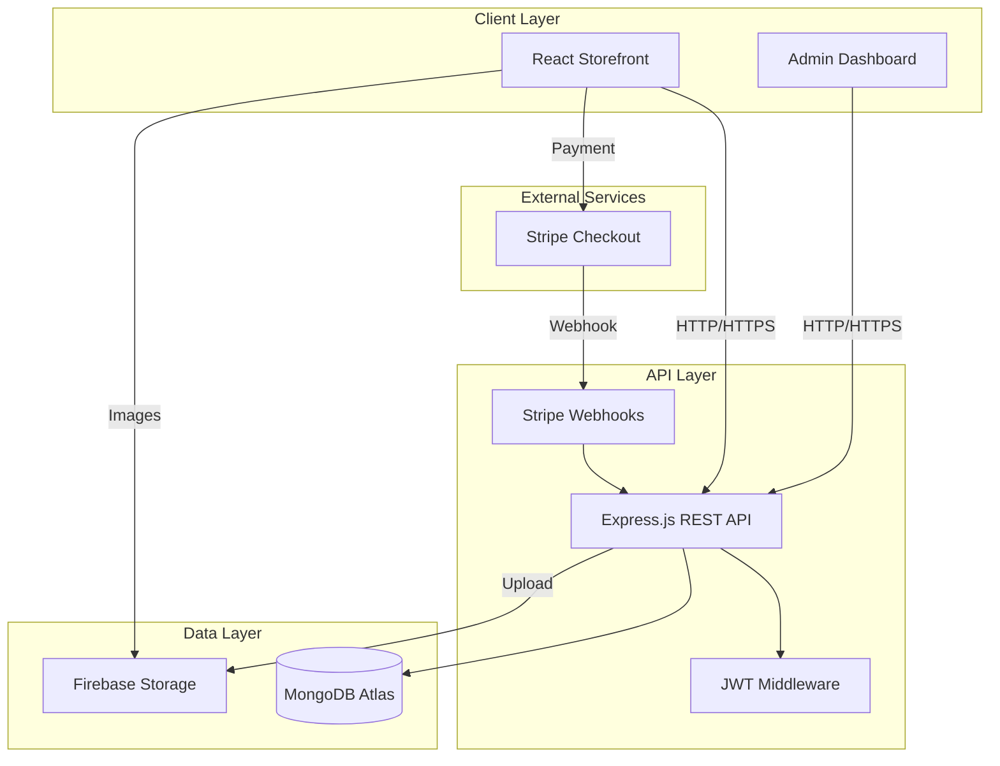

<h1 align="center">🛒 MERN E-Commerce Platform</h1>

## 🎯 Overview

A scalable, modern eCommerce platform built with the MERN stack (MongoDB, Express, React, Node.js). Features secure payment processing via Stripe, cloud-based image storage with Firebase, and a comprehensive admin dashboard for managing inventory, orders, and analytics.

## ✨ Features

- 🖥️ **Modern, responsive UI** built with React and Styled Components  
- 🔄 **Global state management** with Redux Toolkit + Redux Persist  
- 🌐 **Client-side routing** with React Router  
- 🔐 **JWT-authentication** with secure protected routes  
- 🛍️ **Product filtering, sorting, pagination**  
- 💳 **Stripe-integrated secure checkout**  
- ☁️ **Firebase image uploads** for scalable media handling  
- 🗄️ **CRUD-enabled Admin Dashboard** (products, users, orders, analytics)  
- 📊 **Sales analytics & revenue metrics**  
- 📦 **MongoDB Atlas for data storage**  
- ⚙️ **MVC backend architecture using Node.js & Express**  
- 🧪 **API testing using Postman** 

## 🧰 Tech Stack

| Category      | Technologies Used |
|---------------|-------------------|
| **Frontend**  | React, Redux Toolkit, Styled-Components, React Router, Axios |
| **Backend**   | Node.js, Express.js, REST API, JWT Auth, Stripe SDK |
| **Database**  | MongoDB Atlas, Mongoose |
| **Payment**   | Stripe Checkout, Webhooks |
| **Storage**   | Firebase Storage |
| **DevOps / Tools** | Git, Postman, Vercel(deployment), GitHub |
| **Other** | Formik/Yup, React-Toastify, Material UI Icons |

Each technology was selected for scalability, maintainability, and real-world production suitability.

## 🏗️ Architecture Overview

## 🎥 Demo Videos

https://github.com/user-attachments/assets/011463c3-5501-4b00-b4cf-18a6c7c77e72

https://github.com/user-attachments/assets/8b2c24f9-c69f-4020-abc5-0bd0bbc5da97

https://github.com/user-attachments/assets/cada0eee-ea3b-4765-942c-db665c4cb7ef

