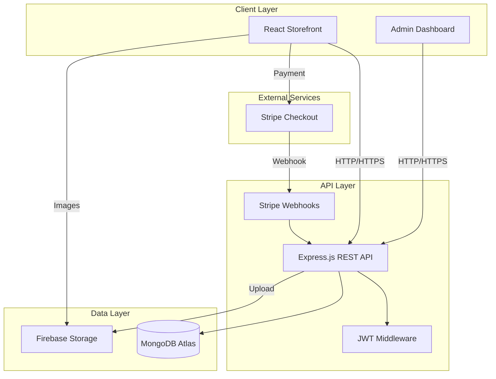

## 🏗️ Architecture

https://github.com/user-attachments/assets/011463c3-5501-4b00-b4cf-18a6c7c77e72

https://github.com/user-attachments/assets/8b2c24f9-c69f-4020-abc5-0bd0bbc5da97

https://github.com/user-attachments/assets/cada0eee-ea3b-4765-942c-db665c4cb7ef
